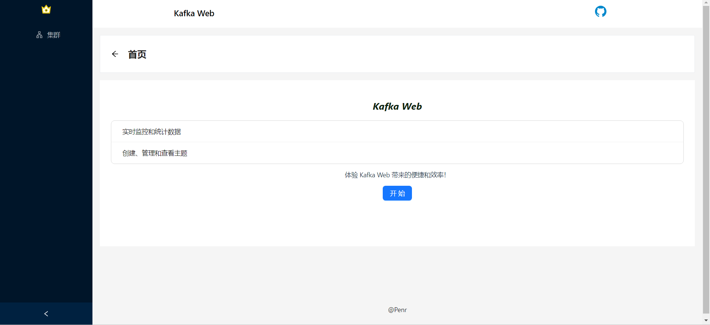
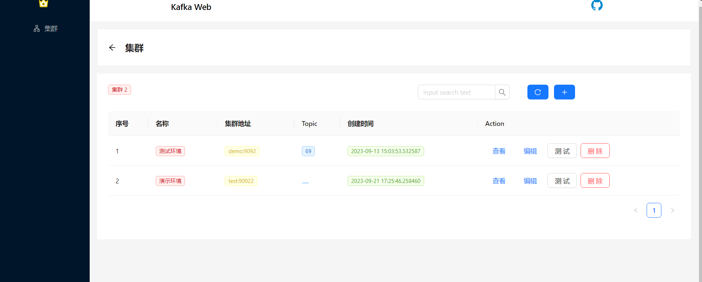
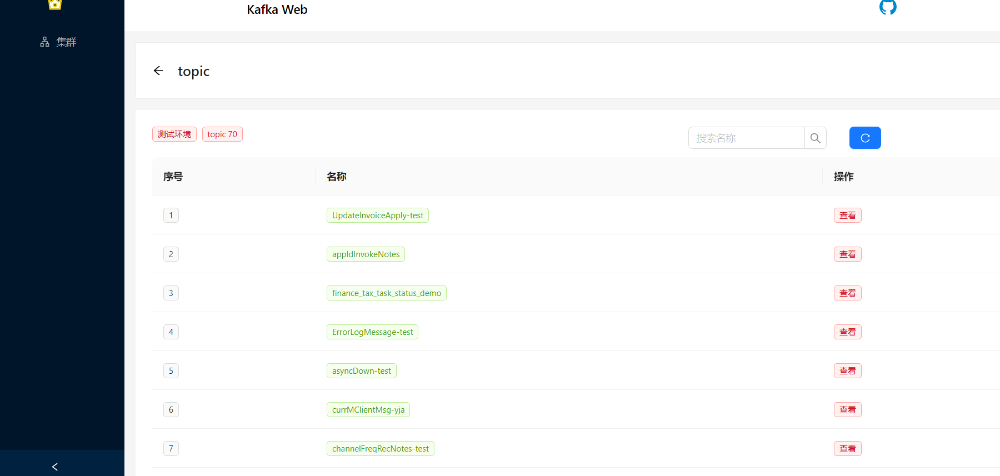
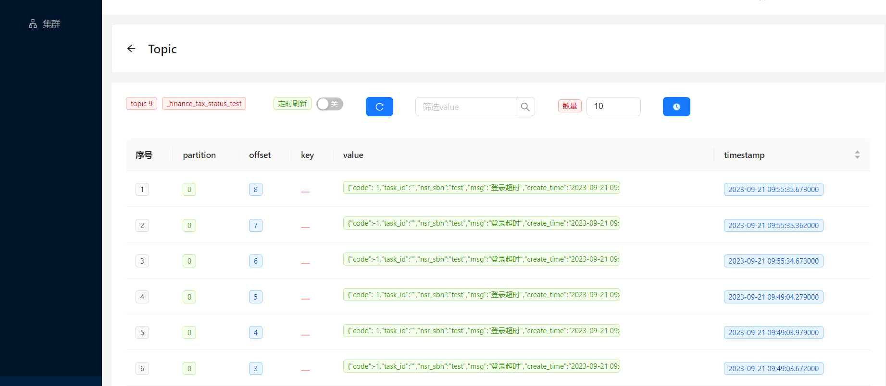
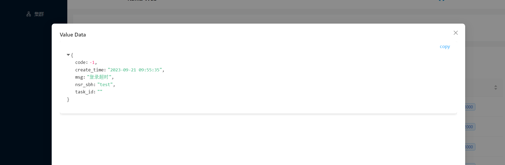

# Kafka Web 可视化数据查询

#### 介绍

> 1. 实时监控和统计数据
> 2. 创建、管理和查看主题
> 3. 支持topic名称的搜索、topic的搜索（默认支持topic数据的前200字符~后200字符）

#### 软件架构

> 1. vue3
> 2. fastapi

#### 数据库

> MongoDb

#### 安装教程

##### 前端

```
cd kafka-pro-ui
```

```
npm i
```

##### 后端

```
cd kafka-api
```

```
python debug.py
```

#### 使用说明
##### 首页



##### 集群


##### Topic



###### topic 数据





